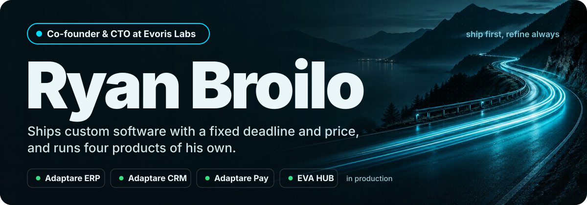

<!--
  ryanlbroilo — GitHub profile README
  Hero: assets/hero.svg (edit text there; system fonts only — GitHub won't load webfonts in SVG)
  Music: Sidra → Last.fm (rylib) → https://github.com/JeffreyCA/lastfm-recently-played-readme
  Backup host if the Vercel one dies: https://lrpr.amatama.net/api?user=rylib
-->

<a href="https://evorislabs.com.br"></a>

<p align="center">
  <a href="https://my-portfolio-wheat-rho-12.vercel.app">Portfolio</a> ·
  <a href="https://www.linkedin.com/in/ryanlbroilo/">LinkedIn</a> ·
  <a href="https://github.com/Evoris-Software">Evoris on GitHub</a> ·
  <a href="https://evahub.com.br">EVA HUB</a>
</p>

<br/>

## Now listening

<div align="center">

[](https://www.last.fm/user/rylib)

</div>

<br/>

## About

I turn ideas into products people actually use — from the first architecture sketch to production, and then the support ticket after. At Evoris I own the technical side of everything: what we ship, how we ship it, and what breaks at 2am.

```ts
const ryan = {
  role:     "Co-founder & CTO",
  company:  "Evoris Labs · incubated at Pulsar / UFSM",
  focus:    ["product engineering", "AI products", "SaaS", "payments"],
  running:  ["Adaptare ERP", "Adaptare CRM", "Adaptare Pay", "EVA HUB"],
  building: ["Plugado"],
  motto:    "ship first, refine always",
};
```

<br/>

## Evoris Labs

A Brazilian software house with a simple rule: scope, deadline and price go into the contract before the first line of code. If the estimate is wrong, the cost is ours. Four partners, no employees — the person who builds it is the person who maintains it.

We also operate what we sell. Four products in production, on the same build our customers get:

| Product | What it does | Status |
|:--|:--|:--|
| **[Adaptare ERP](https://evorislabs.com.br/br/produtos/adaptare-erp)** | Modular self-service ERP with Brazilian tax handled — 18 modules that toggle on/off, NF-e/NFC-e, dual IBS/CBS calculation for the tax reform | 🟢 Production · 1,000+ companies |
| **[Adaptare CRM](https://evorislabs.com.br/br/produtos/adaptare-crm)** | Pipeline, proposals, contracts and projects in one system — a closed deal becomes a project, no export. Legal vertical live | 🟢 Production |
| **[Adaptare Pay](https://evorislabs.com.br/br/produtos/adaptare-pay)** | White-label payment layer over multiple acquirers — Pix, card and boleto on your own domain, tied back to the order in the ERP | 🟢 Production |
| **[EVA HUB](https://evahub.com.br)** | AI specialists that work from your documents — answers cite the source, hand off to a human, run on Brazilian infra with auditable LGPD | 🟢 Production |

**Out of the lab** — client products with Evoris engineering behind them, plus our own bets:

| Product | What it does | Status |
|:--|:--|:--|
| **[Offcard](https://offcard.com.br)** | Marketplace with real cashback — instant Pix with split, referral network, multi-tenant, PWA | 🟢 Production · client |
| **ZonaMax** | Rotating street-parking management — live spot state, inspector app with plate reading, tariffs and revenue reports | 🟢 Production · client |
| **Hub City** | An entire fiber ISP in one system — coverage check, recurring billing that toggles the router, service orders, WhatsApp support | 🟡 In development · client |
| **Plugado** | Everything an EV needs in one app — live charger availability, queue, pay-in-app, trip planner that accounts for battery | 🟡 In development · ours |

<br/>

## Stack

What I actually reach for day to day. Not everything I've ever touched.

| | |
|:--|:--|
| **AI** | Anthropic · OpenAI · LangChain · RAG over customer documents |
| **Front-end** | TypeScript · Next.js · React · Tailwind |
| **Back-end** | Node.js · NestJS · Python · FastAPI |
| **Data** | PostgreSQL · MongoDB · MariaDB · SQLite |
| **Infra & tooling** | Docker · Turborepo · Pix / Stripe integrations |

<br/>

## Albums on repeat

<div align="center">

<a href="https://open.spotify.com/album/1stTB0lnfUPfOIHLJeHSyy"></a>
<a href="https://open.spotify.com/album/7j4ETSgHAFAQcTuQcXuRCY"></a>
<a href="https://open.spotify.com/album/6TJmQnO44YE5BtTxH8pop1"></a>
<a href="https://open.spotify.com/album/6GjwtEZcfenmOf6l18N7T7"></a>
<a href="https://open.spotify.com/album/5SXuuuRpukkTvsLuUknva5"></a>
<a href="https://open.spotify.com/intl-pt/album/1Xsprdt1q9rOzTic7b9zYM"></a>
<a href="https://open.spotify.com/intl-pt/album/7xl50xr9NDkd3i2kBbzsNZ"></a>

</div>

<br/>

<div align="center">

**Let's build something real.** → [relacionamento@evorislabs.com.br](mailto:relacionamento@evorislabs.com.br)

</div>
